# A novel deep learning vision-based approach to structural damage detection
[**Ricard Lado Roigé**](https://github.com/rlado) and Marco A. Pérez

*IQS School of Engineering, Universitat Ramon Llull, Via Augusta 390, 08017, Barcelona, Spain*

## Abstract

Recent developments in computer vision have brought about a new set of techniques called Video Motion Magnification, that are capable of identifying and magnifying eye-imperceptible movements in video data. These techniques have proved effective in applications, such as producing visual representations of an object’s operating deflection shapes or recovering sound from a room behind soundproof glass. Our research explores the new possibilities of motion magnification applied to Structural Health Monitoring (SHM) and vibration testing, harnessing the latest advances in deep learning to achieve state-of-the-art results.

Vision-based damage detection techniques can reduce sensor deployment costs while providing accurate, useful, and full-field readings of structural behaviour. We present a new video processing approach that allows the treatment of video data to obtain vibrational signatures of complex structures. Therefore, enabling the identification of very light structural damage in a controlled lab environment. The presented software approach is based on the use of state-of-the-art deep learning video motion magnification techniques. The technique acts like a microscope for motion, magnifying tiny movements on video sequences, to retrieve seemingly invisible or almost imperceptible movements. Consequently, motion magnification may allow the naked eye to see a structure’s operating deflection shapes as they happened in real operating conditions. The presented vision-based technique offers an easy to use, effective, full-field tool for structural health monitoring at a fraction of the cost of contact-based techniques.

[[1](https://dl.acm.org/doi/10.1145/1073204.1073223)] C. Liu, A. Torralba, W. T. Freeman, F. Durand, E. H. Adelson, ACM SIGGRAPH,  p. 519–526 (2005)

[[2](https://doi.org/10.1016/j.measurement.2022.112218)] R. Lado-Roigé, J. Font-Moré, M. A. Pérez, Measurement(2023)

## Resources

### Wheel_00 Original:

https://user-images.githubusercontent.com/25719985/224738926-fbe75e30-efdc-4479-b93b-8de838796e7d.mp4

### Wheel_00 Magnified:

https://user-images.githubusercontent.com/25719985/224740864-bc2afd05-8ddd-4954-880c-32e5bd915945.mp4

### Three-story building benchmark Original:

https://user-images.githubusercontent.com/25719985/224738287-f3f6c45c-e4ea-45bb-85b6-5dbaa3c16692.mp4

### Three-story building benchmark Magnified:

https://user-images.githubusercontent.com/25719985/224738302-d45a89f7-5aef-4c4d-8ed1-7b1992f53bff.mp4

### AC_01 3 way comparison:

https://user-images.githubusercontent.com/25719985/224739358-417ef3c0-cb4f-4cfa-ad1b-6a1e6abb49c0.mp4

## Code

- Lado-Roigé, R., & Pérez, M. A. (2022). STB-VMM: Swin Transformer Based Video Motion Magnification (Version v1.0.0) [[Computer software](https://github.com/RLado/STB-VMM)]

- Lado-Roigé, R., & Pérez, M. A. (2022). ViMag: A Visual Vibration Toolbox (Version v0.1.6) [[Computer software](https://github.com/RLado/ViMag)]

## Slides
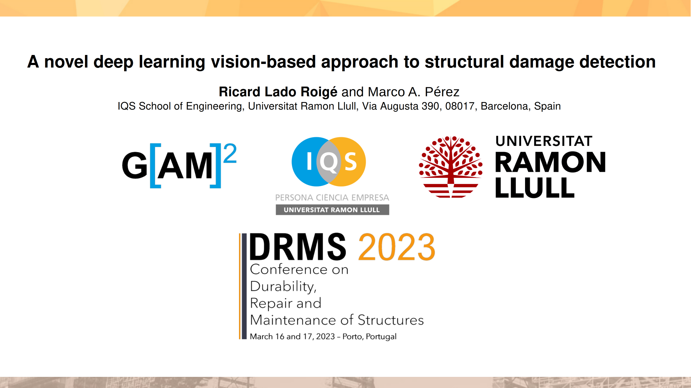
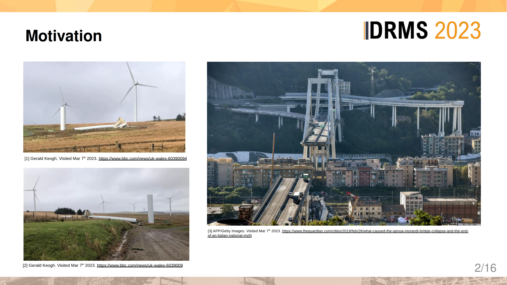
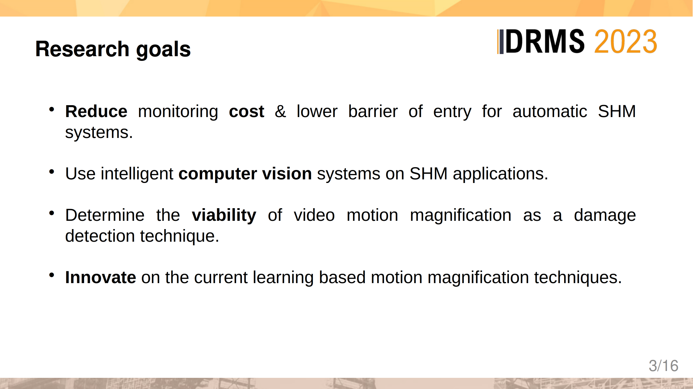
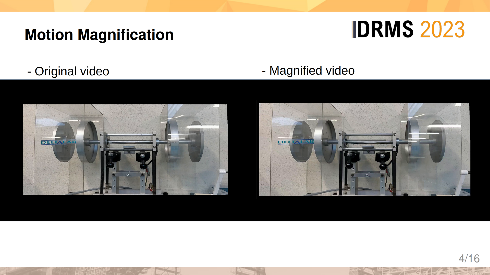
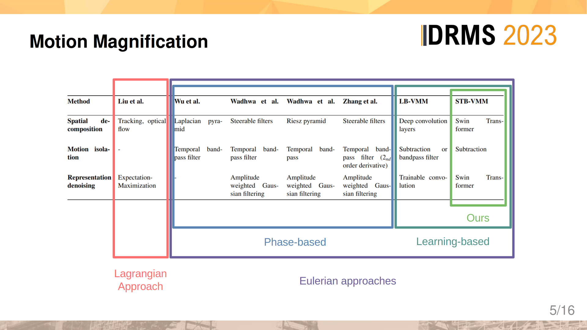
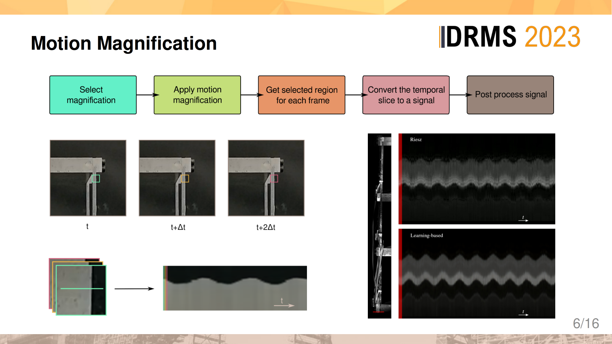
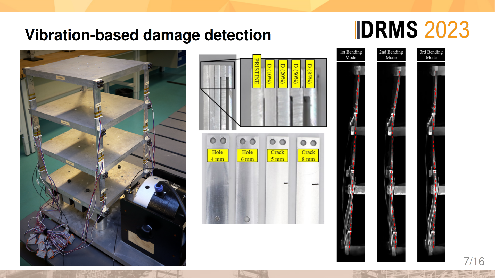
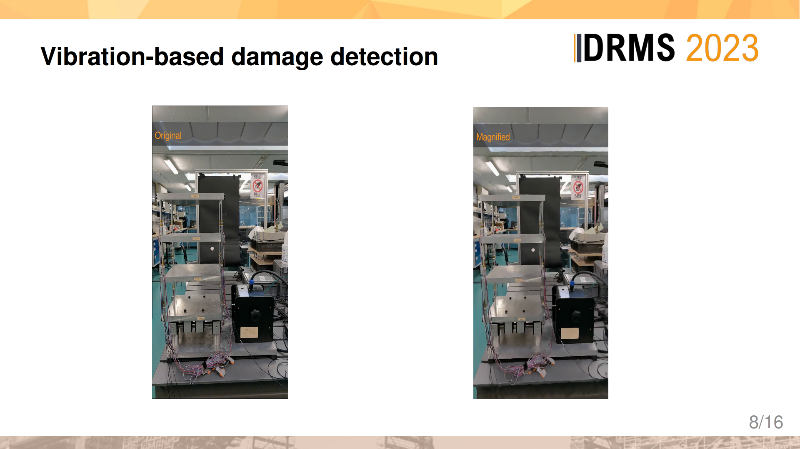
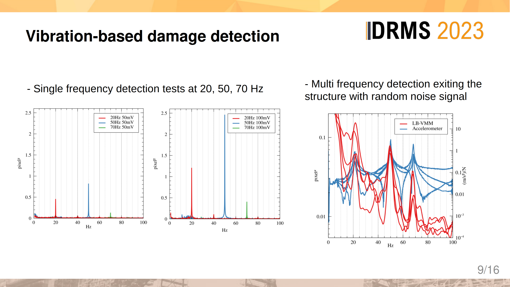
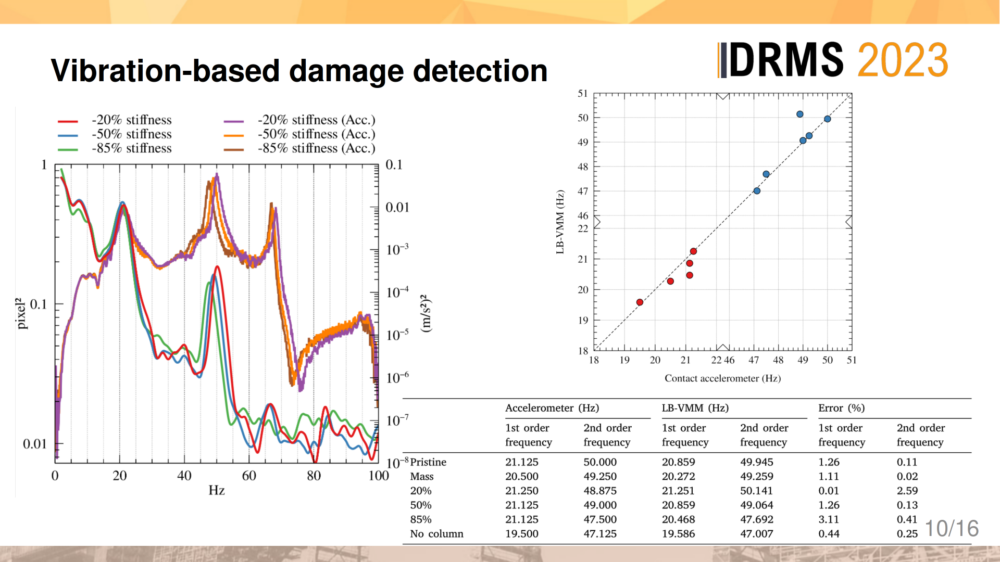
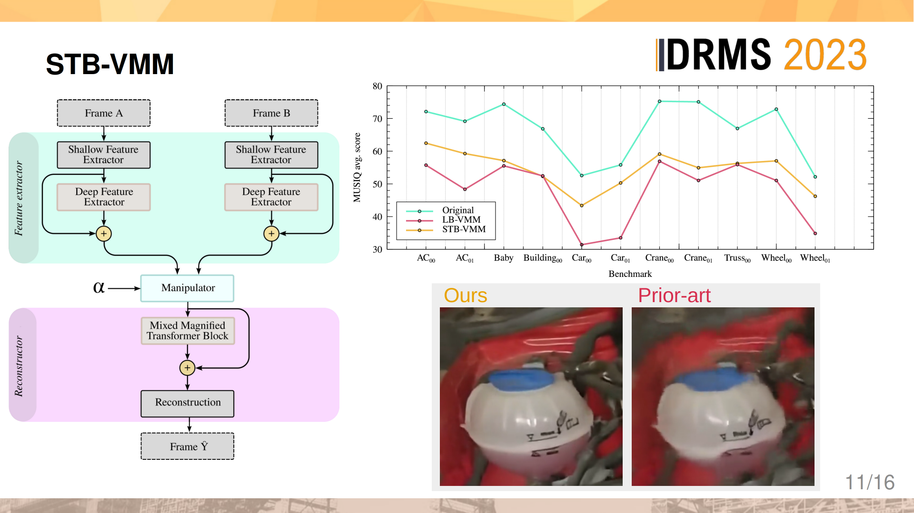
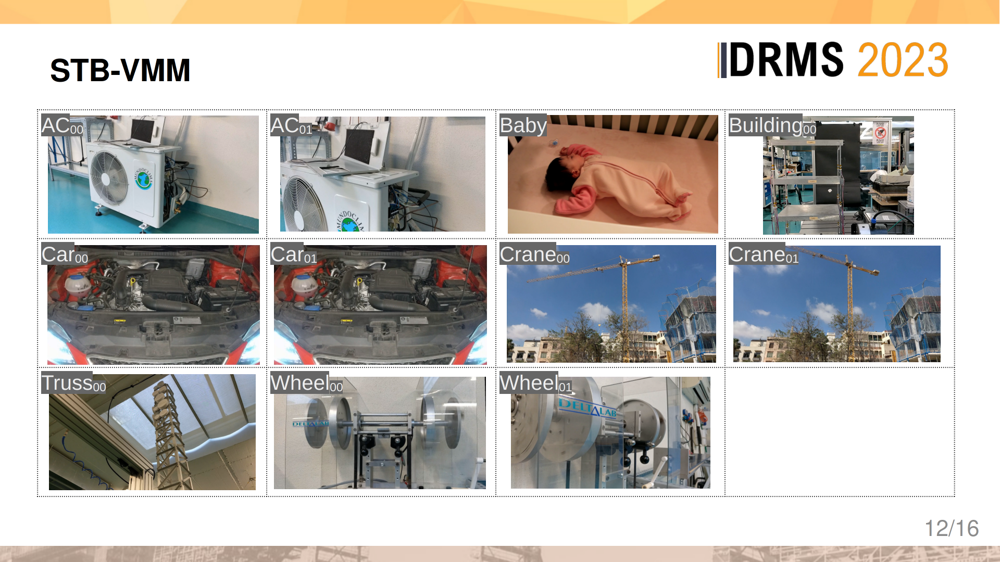
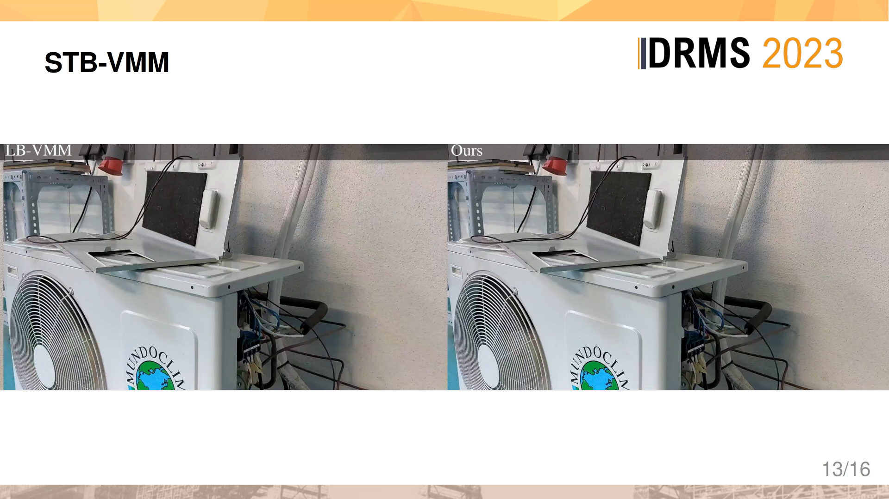
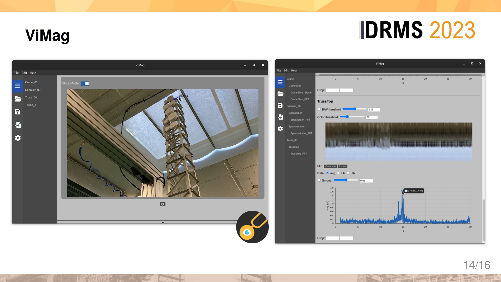
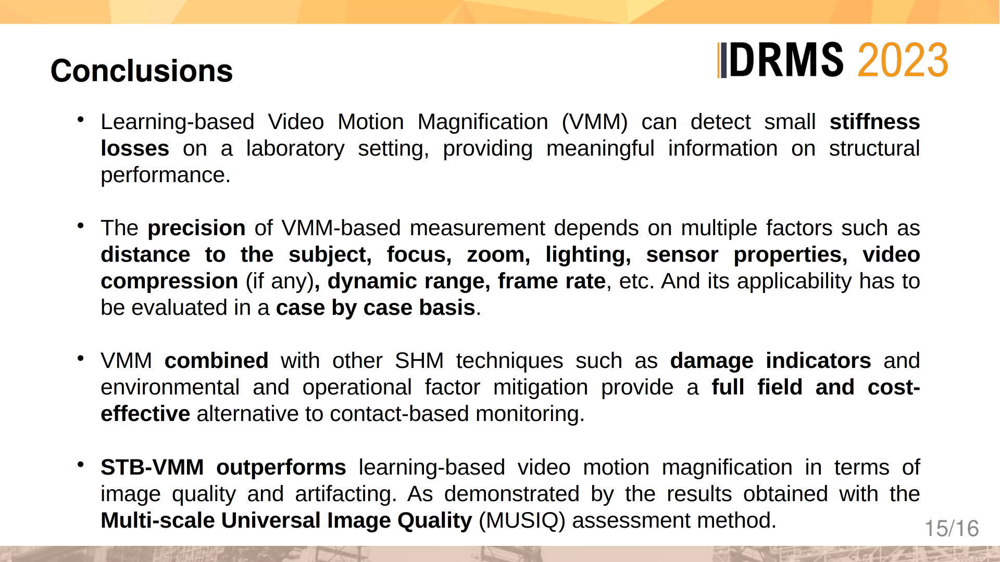
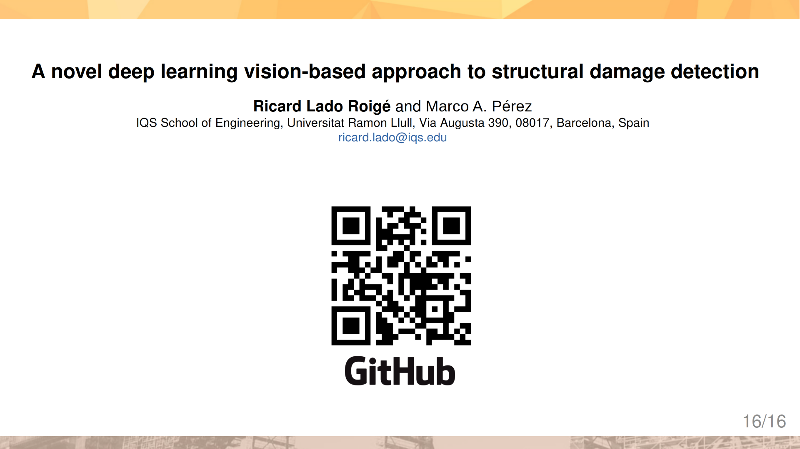
